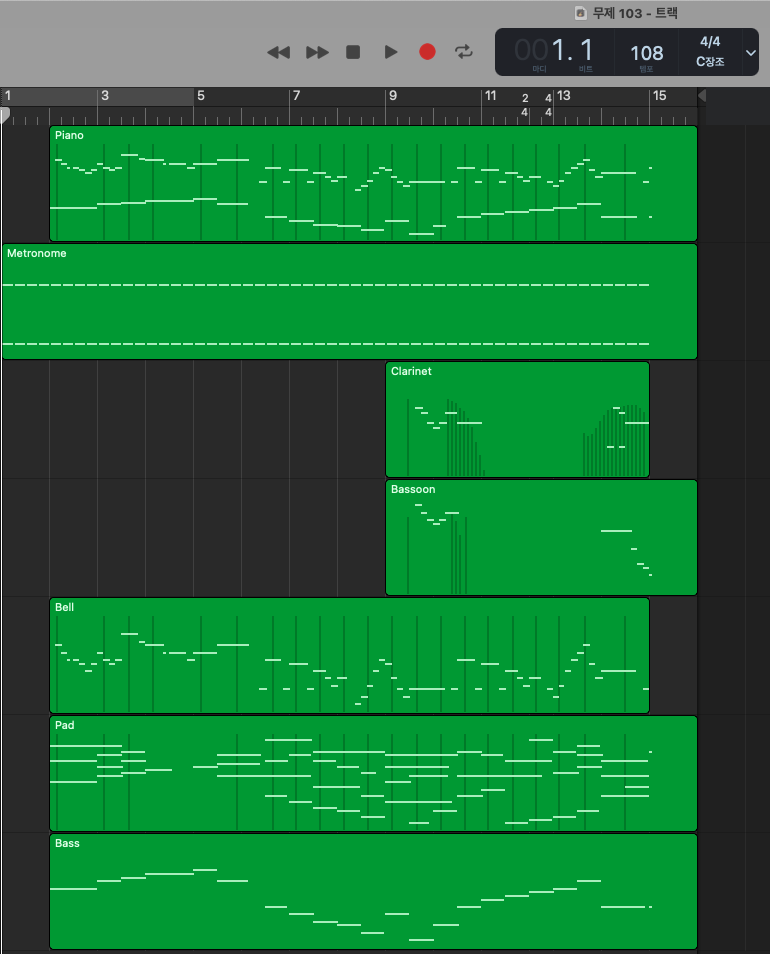
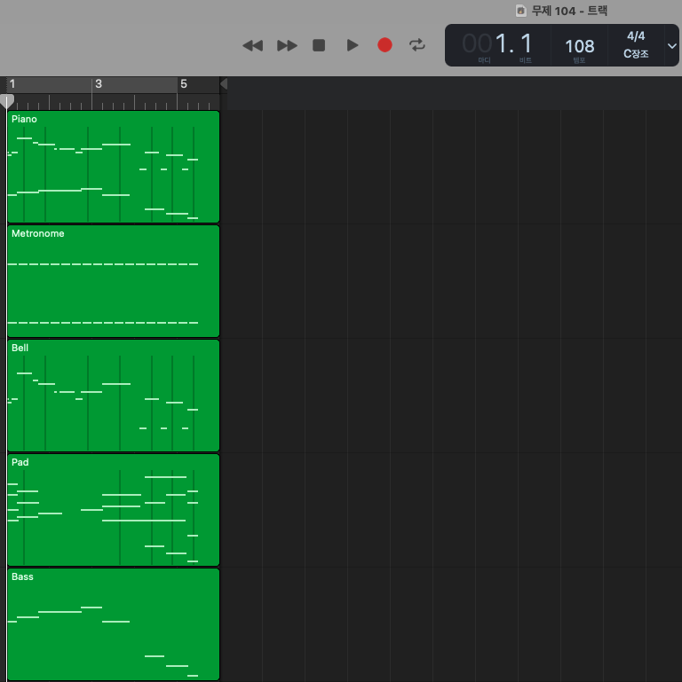

# midi-clip
[](https://pypi.python.org/pypi/midi-clip)

A python package for midi clip (and midi duration) based on mido. ([github](https://github.com/kyaryunha/midi-clip))

Author: Hyun Shin ([kyaryunha](https://github.com/kyaryunha))

### Introduce

This library considers a lot of things for detailing midi clips: followings:

- Supports both multi-track MIDI
- Supports both tempo track & non-tempo track
- Consider controllers that appear before start time or note_on that were not closed
- Consider empty space before the midi
- All note_on and note_off pairs are validate. (Number of note_on and note_off is the same, and all note_on are closed by note_off)

### Usage
```
pip install midi-clip
```

```python
import mido
import midi_clip
# load midi use mido
mid = mido.MidiFile('resources/hosu.mid')
# clip midi
output_mid = midi_clip.midi_clip(mid, 5., 15.)
# you can get total duration(second) of midi
duration = midi_clip.midi_duration(output_mid)
# if you see by print
print(output_mid, duration)
# if you save midi clip
output_mid.save('output.mid')
```

### Result

Result of clip "A Town With An Ocean View" MIDI from 0 to 30 seconds and from 5 to 15 seconds.

<table>
<tr>
<td></td>
<td>0s-30s</td>
<td>5s-15s</td>
</tr>
<tr>
<td>Piano Roll</td>
<td></td>
<td></td>
</tr>
<tr>
<td>Audio</td>
<td>./example/ocean_0_30.wav</td>
<td>./example/ocean_5_15.wav</td>
</tr>
</table>

** Used GarageBand to obtain piano roll images and Cubase to obtain audio.
GarageBand, Cubase fills in the measure regardless of the actual end of track time in the MIDI, resulting in slightly longer audio. MIDI file's time clip is precisely.

** Data used for result was allowed by an anonymous artist.
